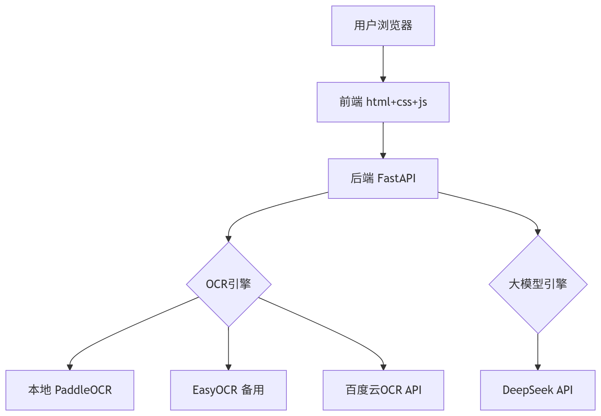
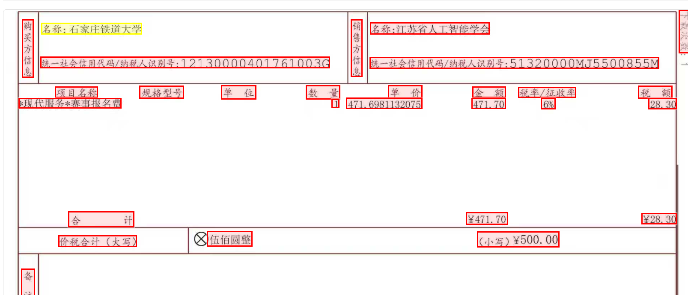
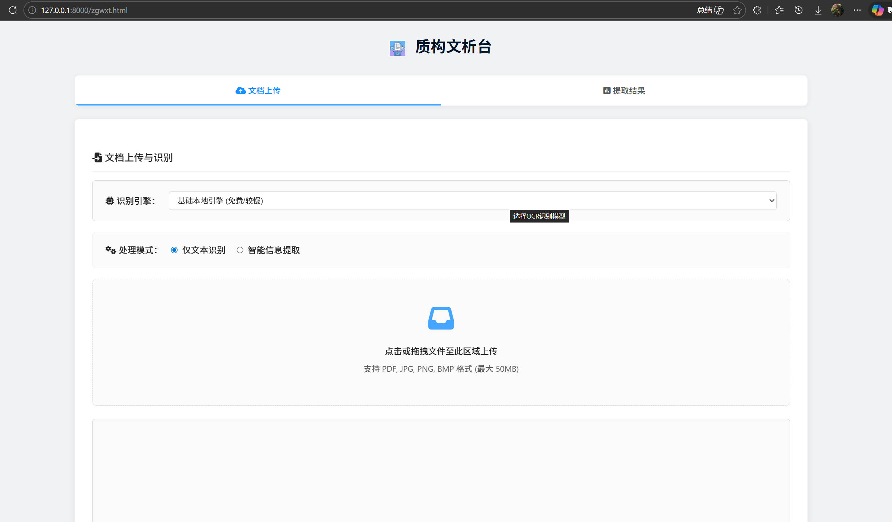
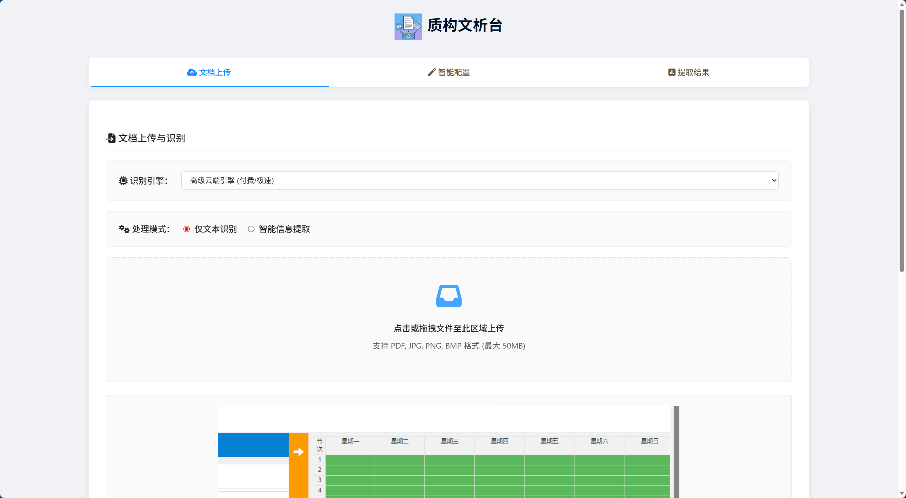

# **智构文析台**

## **一** **、项目信息** 

- **项目名称** ：智构文析台 

- **项目周期** ：2026年1月 - 2026年3月 

## **二、项目背景与概述**

### **2.1 背景**

在当前数字化转型中，企业面临海量合同、发票、证件等文档处理需求。传统人工录入效率低、易出错，而固定模板工具又难以适应格式多样、布局各异的非结构化文档。通过OCR识别、大模型语义理解技术，将文档快速转化为可配置、可复用的结构化数据要素，成为释放文档数据价值的关键。

### **2.2 项目简介**

智构文析台是一个**零代码配置**的智能文档信息提取平台。用户只需通过可视化界面定义需要提取的字段，上传文档，系统即可自动完成 OCR 识别、语义理解、信息提取，并将结果以红框标注的形式在原文档中高亮显示。真正实现“上传即提取，所见即所得”。 

## **三、技术栈全景图**

### **3.1 开发环境**

- **操作系统** ：Windows 11 

- **开发工具** ：VS Code  

- **Python版本** ：3. 10.19 （确保与PaddleOCR兼容） 

- **版本控制** ：Git + GitHub 

### **3.2 技术架构**




### **3.3 技术栈详情**

|**层级**|**技术选型**|**说明**|
|:---:|:---:|:---|
|**后端框架**|Python FastAPI 和 JavaScript|高性能异步框架，自动生成API文档；前端使用原生JS进行交互。|
|**前端框架**|html+css+JavaScript|响应式设计，提供可视化的规则配置与结果展示界面。|
|**OCR引擎**|本地模型和百度智能云 OCR API|集成EasyOCR/PaddleOCR实现本地离线识别，并支持调用百度云API实现高精度识别，可灵活切换。|
|**大模型**|OpenAI兼容接口|通过标准OpenAI API格式与大模型交互，默认配置为DeepSeek模型，也可兼容其他类似模型。|
|**PDF处理**|PyMuPDF (fitz) + reportlab|用于高效解析PDF文档，将其页面转换为图像进行后续处理，并支持生成双层PDF，同时更兼容中文。|
|**图像处理**|OpenCV + Pillow|Pillow用于在结果图上绘制边界框进行可视化；OpenCV作为部分OCR引擎的底层依赖，用于图像预处理。|
|**部署方式**|本地服务 + API调用|通过Uvicorn在本地运行FastAPI应用提供后端API，前端通过HTTP请求调用API，实现前后端分离，开箱即用。|
## **四、核心功能与亮点**

### **4.1 多格式支持** 

支持上传 PDF、JPG、PNG、BMP 等多种格式的文档。

### **4.2 多种OCR引擎** **（关键技术）** 

本地引擎: 集成 EasyOCR 和 PaddleOCR，无需联网即可在本地完成文字识别，保障数据私密性。

云端引擎：支持 百度高精度OCR，提供更快、更准的识别服务（需要配置API Key）。

### **4.3 双模式提取** **（亮点）** 

仅文本识别 (OCR Only): 快速将整个文档转换为纯文本，并支持生成可复制文本的PDF。

智能信息提取 (Extract)：结合大型语言模型（LLM），根据用户定义的规则，从识别后的文本中精准提取关键信息。

### **4.4 灵活的规则配置** **：** 

自然语言配置: 只需用日常语言描述您想提取的内容（例如 “ 我想知道甲方名称和合同金额”），系统即可自动为您生成提取规则。 

结构化配置: 通过界面手动定义每个字段的名称、类型、正则表达式等，适合需要精确控制的场景。

### **4.5 可视化结果:** 



在原始文档的预览图上高亮显示提取出的字段位置，直观明了。

### **4.6 丰富的导出选项** 

支持将提取结果一键导出为JSON, CSV,  PDF,  Word,  Markdown等多种格式，方便后续处理。 

## **五、项目成果展示**

### **5.1 前端界面** 

启动服务后，访问http://127.0.0.1:8000/zgwxt.html ，可以看到设计好的前端界面 ： 



### **5.2 OCR识别效果**

**测试文档** ： 普通发票 （电子发票） 

**识别结果** ： 

```text
电子发票（普通发票）

发票号码：25322000000586031795

开票日期：2025年12月08日

购买方信息 销售方信息 名称：石家庄铁道大学 名称：江苏省人工智能学会

统一社会信用代码/纳税人识别号：12130000401761003G 统一社会信用代码/纳税人识别号：51320000MJ5500855M

项目名称 规格型号 单位 数量 单价 金额 税率/征收率 税额

*现代服务*赛事报名费 1471.6981132075 471.70 6% 28.30

合计 ￥471.70 ￥28.30

价税合计（大写） 伍佰圆整 (小写)￥500.00

备注

开票人：郁艳萍
```

### **5.3 信息提取效果**

**配置规则** ： 
```json

[

  {

    "id": 1,

    "name": "发票号码",

    "type": "text",

    "maxLength": 0,

    "regex": "",

    "description": "发票的唯一标识号码"

  },

  {

    "id": 2,

    "name": "开票日期",

    "type": "date",

    "maxLength": 0,

    "regex": "",

    "description": "发票开具的日期"

  }

]

```

**提取结果** ： 

```json

{

  "extractTime": "2026-03-14T06:28:51.663Z",

  "mode": "extract_only",

  "fields": [

    {

      "name": "发票号码",

      "value": "25322000000586031795",

      "isValid": true

    },

    {

      "name": "开票日期",

      "value": "2025-12-08",

      "isValid": true

    },

   ]

}
```


### **5.4 可视化核验效果**

**红框标注示例** ： 


## **六、 项目使用说明书**

### **6.1 项目结构**


```text
.
├── app/                 		#  后端应用代码 
│   ├──  api /             		# API  端点定义 
│   ├── models/          		#  Pydantic  数据模型 
│   ├── services/        		#  核心服务逻辑  (OCR, LLM) 
│   ├── utils/           		#  工具函数  (PDF 处理, 可视化 ) 
│   ├── config.py        		#  配置文件 
│   └── main.py          		#  FastAPI  应用主入口 
├── frontend/            		#  前端静态文件  (HTML, CSS, JS) 
├── fonts/               		#  生成 PDF 所需的字体文件 （可免费商用） 
├── md/                  		#  项目相关 Markdown 文档 
├── resources/           		#  资源文件  ( 如本地 OCR 模型 ) 
├── requirements.txt     		# Python  依赖列表 
└── README.md            	#  本文档 

```

### **6.2 在线体验** 

您可以点击 [在线体验](https://zgwxt.xinxijiaozanzhu.site) 测试效果，例如： 



>注：因条件限制，在线体验的后端未部署在服务器而是在个人电脑上，若您想使用在线体验功能，请联系邮箱`ddfgg2006@163.com`，我们将在两小时内为您打开后端，并持续开放12小时。带来不便，敬请谅解！

如果您对产线运行的效果满意，可以直接进行**本地**部署 ， 您可以参考 *7.3本地体验* 中的方法进行本地部署。 

注：PaddleOCR模型支持 私有数据 **对产线中的模型进行微调训练** 。如果您具备本地训练的硬件资源，可以直接在本地开展训练；如果没有，星河零代码平台提供了一键式训练服务，无需编写代码，只需上传数据后，即可一键启动训练任务。 具体请参考PP飞桨官方文档：https://paddlepaddle.github.io/PaddleX/latest/index.html。 

### **6.3 本地体验**

#### **6.3.1 环境准备**

- **拉取仓库到本地：**

```bash
git clone  https://github.com/yzy726/ Intelligent_Text_Analysis_Platform .git 

```

- **Python** **：** 建议使用 Python 3.10.19 或更高版本。 

- **安装依赖** **（为防止依赖冲突，建议在虚拟环境中进行）：** 

```bash
cd  Intelligent_Text_Analysis_Platform 

pip install -r requirements.txt

```

*注意：requirements.txt 默认安装 EasyOCR 及其依赖。如果您想使用 PaddleOCR，请* *参照下方步骤* *安装。* 

- **安装** **PaddleOCR** **（此处只列举NVIDIA5060安装命令，其他硬件和型号请参照** **飞桨官网文档** **：** https://paddlepaddle.github.io/PaddleX/latest/installation/paddlepaddle_install.html#docker **）：** 

**（1）安装paddlepaddle框架**

用 pip 在当前环境中安装飞桨 PaddlePaddle：

```bash
# GPU 版本，需显卡驱动程序版本 ≥550.54.14（Linux）或 ≥550.54.14（Windows）

python -m pip install paddlepaddle-gpu==3.0.0 -i https://www.paddlepaddle.org.cn/packages/stable/cu126/

```

安装完成后，使用以下命令可以验证 PaddlePaddle 是否安装成功：

```bash
python -c "import paddle; print(paddle.__version__)"

```

如果已安装成功，将输出以下内容：
```text
3.0.0

```

Windows 系统适配 NVIDIA 50 系显卡的 PaddlePaddle wheel 包安装 ： 

通过以上方式安装的 PaddlePaddle 在 Windows 操作系统下无法正常支持 NVIDIA 50 系显卡。因此，我们提供了专门适配该硬件环境的 PaddlePaddle 安装包。请根据您的 Python 版本选择对应的 wheel 文件进行安装。

```bash
# python 3.10

python -m pip install https://paddle-qa.bj.bcebos.com/paddle-pipeline/Develop-TagBuild-Training-Windows-Gpu-Cuda12.9-Cudnn9.9-Trt10.5-Mkl-Avx-VS2019-SelfBuiltPypiUse/86d658f56ebf3a5a7b2b33ace48f22d10680d311/paddlepaddle_gpu-3.0.0.dev20250717-cp310-cp310-win_amd64.whl

```

**注：**  当前发布的适用于 Windows 系统 50 系显卡的 PaddlePaddle wheel 包，其文本识别模型的训练存在已知问题，相关功能仍在持续适配和完善中。 

**（2）安装飞桨低代码开发工具PaddleX**

您可直接执行如下指令快速安装PaddleX的Wheel包：

```bash
# 仅安装必须依赖（可以在之后按需安装可选依赖）

pip install paddlex

```
通过如下方式仅安装 OCR 功能所需依赖： 
```
pip install "paddlex[ocr]"

```


#### **6.3.2 配置**

项目通过 app/config.py 文件进行配置。

- **大语言模型 (LLM)** **（用于提取信息）** : 

 本项目兼容所有支持 OpenAI API 格式的 LLM 服务，例如 DeepSeek, Kimi, Qwen, ZhipuAI 等。

 请在 app/config.py 中填入您的 LLM_API_KEY, LLM_BASE_URL 和 LLM_MODEL。 （以deepseek为例） 
```py
class Settings(BaseSettings):

    # ...

    # LLM 配置

    LLM_PROVIDER: str = "deepseek"

    LLM_API_KEY: str = "sk-your-api-key"     # 请在此处填入你的 API Key 

    LLM_BASE_URL: str = "https://api.deepseek.com/v1"     # 如果使用代理或其他兼容接口，请修改此处 

    LLM_MODEL: str = "deepseek-chat"

    # ...

```

- **百度云 OCR (可选)** : 

如果您希望使用百度云 在线 OCR，请在 app/config.py 中填入您的 BAIDU_OCR_API_KEY 和 BAIDU_OCR_SECRET_KEY。 
```py
class Settings(BaseSettings):

    # ...

    BAIDU_OCR_API_KEY: str = "your-baidu-api-key"  # 请在此处填入你的Baidu API Key 

    BAIDU_OCR_SECRET_KEY: str = "your-baidu-secret-key"  # 请在此处填入你的 Baidu Secret Key

    # ...

```


- **文档图像方向分类模块、文本图像矫正模块和文本行方向分类模块（可选）：**

PaddleOCR支持更换和添加模型，仓库中resources/目录下放置了部分文档图像方向分类模型(/ PP-LCNet_x1_0_doc_ori_infer )、文本图像矫正模型(/ UVDoc_infer )和文本行方向分类模型(/ PP-LCNet_x1_0_textline_ori_infer )。 

如果想使用以上模型，请打开依赖安装路径下的 \paddlex\configs\pipelines\OCR.yaml ，修改以下配置： 
```yaml
SubPipelines:

  DocPreprocessor:

    # ... 

    SubModules:

      DocOrientationClassify:

        module_name: doc_text_orientation

        model_name: PP-LCNet_x1_0_doc_ori

        model_dir:  "\ Intelligent_Text_Analysis_Platform\resources\PP-LCNet_x1_0_doc_ori_infer\PP-LCNet_x1_0_doc_ori_infer "    # 替换成项目地址

      DocUnwarping:

        module_name: image_unwarping

        model_name: UVDoc

        model_dir: "\Intelligent_Text_Analysis_Platform\resources\UVDoc_infer\UVDoc_infer"  # 替换成项目地址

    #... 

  TextLineOrientation:

    module_name: textline_orientation

    model_name: PP-LCNet_x1_0_textline_ori 

    model_dir: "\Intelligent_Text_Analysis_Platform\resources\PP-LCNet_x1_0_textline_ori_infer\PP-LCNet_x1_0_textline_ori_infer"  # 替换成项目地址

  #... 
  
  ```


#### **6.3.3 启动服务**

在项目根目录下运行以下命令：

uvicorn app.main:app --host 0.0.0.0 --port 8000 --reload


\--reload 参数可以在代码变更后自动重启服务，适合开发环境。

#### **6.3.4 访问前端**

服务启动后，在浏览器中打开  [http://127.0.0.1:8000/zgwxt.html](http://127.0.0.1:8000/zgwxt.html) ，或可以直接在浏览器中打开 frontend/zgwxt.html 文件来使用 。 

### **6.4 使用流程**

1.**上传文档** : 在“文档上传”页面，选择一个OCR引擎，然后点击或拖拽文件进行上传。 

2.**选择模式** :  

- a) 如果选择  **“仅文本识别”** ，上传后直接点击“启动分析流程”，系统将执行OCR并跳转到结果页。 

- b) 如果选择  **“智能信息提取”** ，则需要进一步配置提取规则。 

3.**配置规则** :  

- **a)** **智能配置** : 在“智能配置”标签页，用自然语言描述您的需求，点击“智能解析需求”，系统会自动生成字段列表。 

- **b)** **手动配置** : 在“手动配置”标签页，逐一添加您需要提取的字段及其属性。 

4.**执行提取** : 确认规则无误后，点击“应用规则并执行提取”。 

5.**查看与导出** : 系统将跳转到“提取结果”页面，您可以在此查看结果、可视化的标注图，并选择合适的格式进行导出。 

## **七、项目难点与解决方案**

|**难点**|**解决方案**|**成效**|
|:---|:---|:---|
|**PaddleOCR环境兼容性**|锁定Python  3.10.19  +  NumPy  1.23.5 |成功解决编译错误|
|**多版本依赖冲突**|使用requirements.txt精确控制版本|环境可复现，一键安装|
|**坐标精准映射**|统一使用四点坐标格式，前端精确计算|红框定位误差<5像素|
|**大模型响应不稳定**|设计结构化Prompt，强制JSON返回|解析成功率98%|
|**PDF多页处理**|逐页转换图片，合并OCR结果|支持任意页数文档|
## **八、总结与展望**

### **8.1 项目成果总结**

经过两个月的开发，我们成功实现了：

- **零代码配置** 的可视化字段管理界面 

- **多引擎OCR** ，支持本地与云端切换 

- **大模型智能提取** ，准确率超90% 

- **红框标注核验** ，结果可追溯 

- **全流程可视化** ，从上传到导出无缝衔接 

- **模块化API设计** ，便于后续扩展 

### **8.2 项目优势**

1. **零门槛** ：业务人员无需编程即可使用 

2. **高可用** ：支持多种文档格式，适应多样版式 

3. **可追溯** ：红框标注让AI结果透明可信 

4. **可扩展** ：模块化架构，易于添加新引擎 

### **8.3 未来展望**

- **手写体识别** ：增加对手写文档的支持 

- **表格识别** ：提取文档中的表格数据 

- **多语种支持** ：扩展日文 、韩文 等语种 

- **增量学习** ：用户修正的结果反哺模型 

- **增加LLM数量：** 添加更多的大语言模型供用户选择，进一步提高精确度 

- **云端部署** ：提供 docker 服务，开箱即用 

## **九、致谢**

 感谢团队成员的通力合作与不懈努力！

 感谢竞赛组委会提供的展示平台！


智构文析台 —— 让文档处理更智能，让数据提取更简单 

**项目地址** ： [https://github.com/yzy726/Intelligent_Text_Analysis_Platform](https://github.com/yzy726/Intelligent_Text_Analysis_Platform) 

**联系方式** ： 

ddfgg2006@163.com 	杨先生 

scx131002@163.com 	史先生